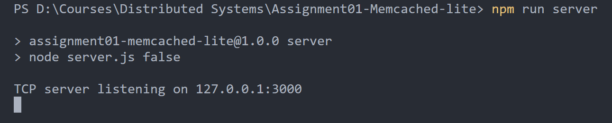

## 1. Prerequisites

- Node.js: Ensure that Node.js is installed on your system. You can download the LTS from [https://nodejs.org/en](https://nodejs.org/en)

- npm Packages: Open a terminal and navigate to the project directory. Run the following command to install the required npm packages.

  ```js
  npm install
  ```

## 2. How to run the TCP server

- Open a terminal and navigate to the project directory. Run the following command to run the TCP server.

  ```js
  npm run server
  ```

  **NOTE** : If you run the server with this command it will not work properly with regular Memcached Clients. Hence use this only when you want to test custom client or if you want to connect from command line using telnet.

    

## 3. How to run the TCP Server with regular Memcached-Client compatability

- Open a terminal and navigate to the project directory. Run the following command to run the TCP server with memcached client compatability.

  ```js
  npm run memcache-server
  ```

  **NOTE** : Use this if and only if you want to connect with regular off-the-shelf Memcached clients. For all other cases please use `npm run server`.

    

## 4. How to run the Test cases

### A. Testing with Custom client

- Open a terminal and navigate to the project directory. Run the following command to run the TCP server.

  ```js
  npm run server
  ```

- Open another terminal and navigate to the project directory. Run the following command to run the testcases.

  ```js
  npm run test-client
  ```

### B. Testing with Memcached client

- Open a terminal and navigate to the project directory. Run the following command to run the TCP server with memcached client compatability.

  ```js
  npm run memcache-server
  ```

- Open another terminal and navigate to the project directory. Run the following command to run the testcases.

  ```js
  npm run test-memcache-client
  ```

### C. Testing with Command Line (User Input)

- Open a terminal and navigate to the project directory. Run the following command to run the TCP server.

  ```js
  npm run server
  ```

- Open another terminal anywhere. Run the following command to connect to the TCP server from command line.

  ```js
  telnet 127.0.0.1 3000
  ```
