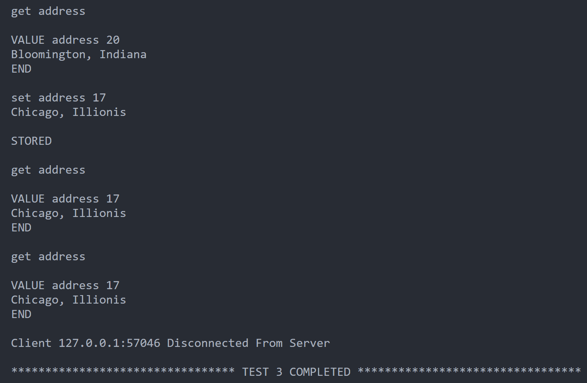
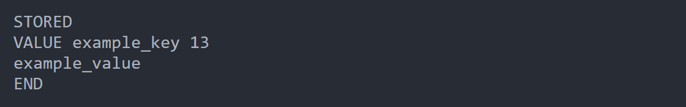

# Memcached-Lite

## The Core TCP Server

`server.js` conatins the code that handles a TCP Server which is a lightweight implementation of a key-value store, serving as a simplified version of Memcached, enabling clients to perform 'set' and 'get' operations.

The server employs a simple event-driven architecture using Node.js's `net` module. Each incoming client connection is handled asynchronously, allowing multiple clients to connect simultaneously.

### 1. How the server starts ?

- The TCPServer function is defined to encapsulate the server's functionality. It takes the desired port and host as parameters.

  ```js
  function TCPServer(port, host) {
    // Server Implementation
  }
  ```

- The server is created using `net.createServer()`, and an array (sockets) is initialized to store all client sockets.

  ```js
  const server = net.createServer();
  const sockets = [];
  ```

- The server is configured to listen on the specified port and host. The TCPServer function returns a promise which resolves when the server starts listening.

  ```js
  return new Promise((resolve, reject) => {
    server.listen(port, host, () => {
      console.log(
        `TCP server listening on ${server.address().address}:${
          server.address().port
        }`
      );
      resolve();
    });
  });
  ```

- Finally, the server is started by invoking the TCPServer function with the desired host and port.

  ```js
  TCPServer(PORT, HOST).then(() => {});
  ```

### 2. How does the server handle incoming client connections ?

- When a client establishes a connection to the server, the event handler associated with the "connection" event is triggered.

  ```js
  server.on("connection", (socket) => {
    // Connection Event Handling
  });
  ```

- Upon connection, a state object is created for the client socket to manage the progress of incoming commands. This state object includes fields like key, flags, exptime, bytes, and receivedData. The client socket is added to the sockets array to keep track of all connected clients.

  ```js
  socket.state = {
    key: "",
    flags: "",
    exptime: "",
    bytes: "",
    receivedData: "",
  };

  sockets.push(socket);
  ```

- Event handlers are set up to manage incoming data `on("data")`, socket closure `on("close")`, and errors `on("error")`.

  ```js
  socket.on("data", async (data) => {
    await onData(socket, data);
  });

  socket.on("close", () => {
    console.log(
      `Closed Connection from ${socket.remoteAddress}:${socket.remotePort}`
    );
  });

  socket.on("error", (err) => {
    console.error(`Client Error ${socket.remoteAddress}:${socket.remotePort}`);
  });
  ```

### 3. How does the server handle incoming data/commands from the connected clients ?

- When data is received from a client, the event handler associated with the "data" event is triggered.

  ```js
  socket.on("data", async (data) => {
    await onData(socket, data);
  });
  ```

- The onData function is called asynchronously to handle the incoming data. It keeps track of the client's state, including details like key, flags, exptime, bytes, and receivedData.

  ```js
  async function onData(socket, data) {
    let { key, flags, exptime, bytes, receivedData } = socket.state;
    receivedData += data.toString();
    // Further processing... (refer code for implementation details)
  }
  ```

- The function processes the received data, extracting individual commands delimited by the specified delimiter (\r\n). It ensures that partial or complete commands are appropriately handled.

  ```js
  while (receivedData.includes(delimiter)) {
    const firstClrfIdx = receivedData.indexOf(delimiter);
    const command = removeBackspaces(receivedData.slice(0, firstClrfIdx));
    receivedData = receivedData.slice(firstClrfIdx + 2);
    // Further processing... (refer code for implementation details)
  }
  ```

- Depending on the nature of the command (e.g., "set" or "get"), the server executes the corresponding action. For example, storing key-value pairs or retrieving values based on the key.

  ```js
  if (arr[0] == "set") {
    // handle SET request
  } else if (arr[0] == "get") {
    // handle GET request
  } else if (bytes) {
    // handle VALUE
  }
  ```

### 4. Handling SET Command

```js
/*
set key flag exptime bytes \r\n
VALUE \r\n

(or)

set key bytes \r\n
VALUE \r\n
*/

/*
STORED \r\n

(or)

NOT-STORED \r\n
*/

// Sample commands
set phone 0 100 10
8106501550

set phone 10
8106501550
```

- Expiration time (exptime) and flag parameters are included so that the TCP Server will work with regular, off-the-shelf memcached clients.

- Once the complete value is received, the server proceeds to handle the SET request. This involves tasks like writing the key-value pair to a storage file `kvstore.json`.

- Before performing a write operation (handling a SET request), the server acquires the lock using `fileLock.acquire()` which is a mutex. This ensures exclusive access to the shared resources during the complete request.

- To simulate real-world scenarios and concurrency challenges, the server introduces a random sleep period using `await randomSleep()` (Implementation can be found in `utils.js`)

- After completing the SET request, the server releases the lock using `release()`. Releasing the lock allows other threads to acquire it and perform subsequent read or write operations. This prevents race conditions and ensures data consistency when multiple clients are interacting with the server concurrently.

```js
async function handleSetRequest(key, flags, exptime, bytes, value) {
  const release = await fileLock.acquire();
  await randomSleep();
  try {
    const jsonData = await readJSONFile("kvstore.json");
    jsonData[key] = { flags, exptime, bytes, value };
    await writeJSONFile("kvstore.json", jsonData);
    return "STORED \r\n";
  } catch (err) {
    console.error(err);
    return "NOT-STORED \r\n";
  } finally {
    release();
  }
}
```

### 5. Handling GET Command

```js
/*
get key \r\n
*/

/*
VALUE key bytes \r\n
data \r\n
*/

// Sample command
get phone

// Sample response
VALUE phone 10
8106501550
```

- Before accessing the shared resource (reading from `kvstore.json`), the server acquires the lock using `fileLock.acquire()`.

- To simulate real-world scenarios and concurrency challenges, the server introduces a random sleep period using `await randomSleep()` (Implementation can be found in `utils.js`)

- The server reads the contents of the key-value store (`kvstore.json`) to retrieve the data associated with the provided key. If the key exists in the store, the server generates a response in the form of a data packet (using the Memcached protocol) containing the key, value length, and the actual value.

- After completing the read operation and generating the response, the server releases the lock using `release()`. This allows other threads to acquire the lock for subsequent operations.

- The locking mechanism ensures that only one thread can access the shared resource (`kvstore.json`) at a time, preventing concurrent reads or writes.

```js
async function handleGetRequest(key) {
  const release = await fileLock.acquire();
  await randomSleep();
  try {
    const jsonData = await readJSONFile("kvstore.json");
    if (jsonData[key]) {
      const { value } = jsonData[key];
      return `VALUE ${key} ${value.length}\r\n${value}\r\nEND\r\n`;
    }
    return "null\r\n";
  } catch (err) {
    console.error(err);
    return "Internal Server Error \r\n";
  } finally {
    release(); // Release the lock after completing the operation.
  }
}
```

### 6. What kind of conflicts or race conditions are handled ?

- Multiple clients attempt to execute a SET command (write operation) simultaneously. The `async-mutex` ensures that only one thread at a time can acquire the lock. This prevents concurrent writes to the key-value store (`kvstore.json`), maintaining data consistency.

- One client is performing a GET command (read operation) while another client is executing a SET command. The lock prevents concurrent access to the key-value store, ensuring that no other thread can read or write during an ongoing read or write operation. This avoids potential inconsistencies in the data.

- Multiple clients request data using GET commands at the same time. The lock ensures that only one thread can read from the key-value store at a time. This prevents multiple clients from accessing the store simultaneously, maintaining sequential execution of read operations.

- Two clients attempt to execute SET commands for the same key simultaneously. The lock guarantees that only one thread can update a specific key in the key-value store at a time. This prevents race conditions where two threads may overwrite each other's changes to the same key.

### 7. Where/How is the data stored ?

- The server utilizes this `kvstore.json` file as a persistent storage mechanism for maintaining key-value pairs.

- when a client sends a SET command, the server reads the existing data from "kvstore.json," updates it with the new key-value pair, and writes the modified data back to the file. Similarly, when a client issues a GET command, the server reads the relevant data from the file and sends it back to the client.

- Essentially, the file acts as a simple database for the server, enabling it to persistently store and retrieve key-value data across different client connections.

```js
// Sample key-value pair
"phone": {
  "flags": "0",
  "exptime": "100",
  "bytes": "10",
  "value": "8128039055"
}

/*
Key: A unique identifier for the data entry.
Flags: A parameter in Memcached indicating metadata about the data.
Exptime: Expiration time, indicating how long the data should be considered valid (measured in seconds).
Bytes: The size of the data value in bytes.
Value: The actual data associated with the key.
*/
```

### 8. How Errors are Handled ?

- The code uses try-catch blocks around file read and write operations (`readJSONFile` and `writeJSONFile` functions) (Implementations can be found in `util.js`). In case of file-related errors, the code prints the error to the console using `console.error` and responds with `"NOT-STORED \r\n"` to the client.

- The code catches errors that might occur during JSON parsing. If a JSON parsing error occurs, the code prints the error to the console and responds with `"Internal Server Error \r\n"` to the client.

- The code has error event listeners on client sockets. In case of a client socket error, the code prints an error message to the console using console.error.

## The Custom Client

- A specialized TCP client is designed to interact with a Memcached-lite server. The client is tailored for testing purposes, allowing users to send set and get requests to the server and receive responses. Code can be found in `customClient.js`.

- The TCPClient function returns a promise which resolves upon a connection to desired TCP server over given port and host. It encapsulates functionality for sending set and get requests, handling server responses, and disconnecting gracefully.

  ```js
  function TCPClient(port, host) {
    // Client Implementation
  }
  ```

- Usage: To use the client, instantiate it with specific port and host parameters. The client object is returned as a Promise. Upon instantiation, the client automatically establishes a connection with the server, simplifying the testing process.

  ```js
  const { TCPClient } = require("./TCPClient");

  const client = await TCPClient(3000, "localhost");
  ```

- `set(key, value)`: Sends a set request to the server.

  ```js
  const response = await client.setRequest("example_key", "example_value");
  ```

- `get(key)`: Sends a get request to the server.

  ```js
  const response = await client.get("example_key");
  ```

- `disconnect()`: Disconnects the client from the server gracefully.
  ```js
  await client.disconnect();
  ```

## The Memcached Client

- A typical off-the-shelf Memcached client for Node.js is the memcached library. [https://www.npmjs.com/package/memcached](https://www.npmjs.com/package/memcached)

- Usage: require the library and instantiate the client with appropriate host and port.

  ```js
  const Memcached = require("memcached");
  ```

- set and get operations:

  ```js
  const key = "example_key";
  const value = "example_value";

  // Set operation
  memcached.set(key, value, 100, (err) => {
    if (!err) {
      console.log("Data stored successfully.");
    }
  });

  // Get operation
  memcached.get(key, (err, data) => {
    if (!err) {
      console.log(`Value for ${key}: ${data}`);
    }
  });
  ```

## Testing with custom client

- `test.js` is a script with four test cases assessing the response of a TCP server to interactions with a custom client. The tests cover various scenarios, such as multiple SET and GET commands, random operations, and concurrent requests, ensuring a comprehensive evaluation of the custom client's behavior.

**Test Case 1 : Multiple SET Commands**

- Demonstrates the ability to send multiple SET commands from single client to the server. Sets the value for the "phone" key multiple times. Sets the value for the "food" key multiple times. Outputs the server's response for each SET command.

- Refer the `test1()` function in test.js. Five SET requests are sequentially made to the server using the custom TCP client. Each SET request updates the value associated with a specific key.

  

**Test Case 2 : Multiple GET Commands**

- Shows the capability to send multiple GET commands from single client to the server. Retrieves the value for the "phone" key multiple times. Retrieves the value for the "food" key multiple times. Outputs the server's response for each GET command.

- Refer the `test2()` function in test.js. Five GET requests are sequentially made to the server using the custom TCP client. Each GET request retrives the value associated with a specific key. The previously stored key-value pairs by running test1() are retrived here.

  

**Test Case 3 : Random SET and GET Commands**

- Validates the ability to perform a mix of SET and GET commands from a single client to the server. Sets and retrieves the value for the "name" key. Sets and retrieves the value for the "address" key. Outputs the server's response for each SET and GET command. Refer the `test3()` function in test.js

  
  

**Test Case 4 : Concurrent Requests from 3 Clients**

- Checks the server's behavior with concurrent requests from multiple clients. Three clients simultaneously set and get the value for the "course" key. Outputs each client's actions and the server's responses.

  
  
  

## Testing with regular Memcached client

- The code found in `memcachedClient.js` uses the "memcached" library to interact with a Memcached server. It sets a key-value pair ("example_key" with "example_value") and retrieves the value for the same key. The results are logged, and the connection to the Memcached server is closed afterward.

- This test involves utilizing a standard Memcached client to interact with the core TCP server. The test exemplifies the compatibility of the server with regular Memcached clients.

  
